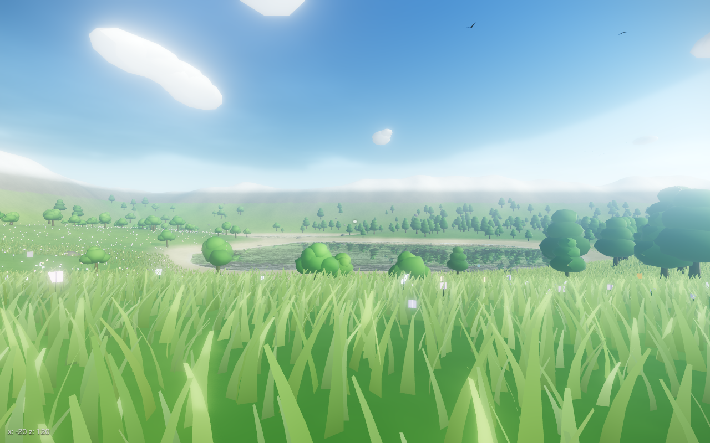

# Open World — 草原・湖畔・森

Three.js 製のプロシージャル・オープンワールドデモ。外部アセット（3D モデル・画像テクスチャ）に一切依存せず、地形・植生・PBR テクスチャまですべてノイズから実行時生成します。一人称視点で自由に歩き回れます。



## 実行方法

```bash
npm install
npm run dev
```

ブラウザで http://localhost:5173 を開き、画面をクリックすると操作開始。

## 操作

| キー | 動作 |
|---|---|
| W A S D / 矢印キー | 移動 |
| マウス | 視点 |
| Shift | ダッシュ |
| Space | ジャンプ |
| Esc | メニューに戻る |

## ワールドの構成

- **地形** — fBm 値ノイズによる 800m 四方・512×512 分割のプロシージャル地形。高さと法線由来の傾斜から草地・乾草・砂浜・岩肌・雪頂を頂点カラーで塗り分け。フラグメントシェーダではワールド座標ノイズの**勾配から微細バンプ法線**を作って近距離だけ粒状の凹凸を出し、草地には**土の色むら**を混ぜる（どちらも距離フェード付きで遠景はちらつかない）。水際には泡の帯。外周はノイズで起伏をつけた山脈で囲う
- **湖** — 地形をノイズで歪ませたすり鉢状に窪ませて生成。水面は three.js の Water（平面リフレクション）で対岸の森・雲・空が映り込む。法線マップはタイル化可能ノイズの **2 スケール合成**（うねり＋さざ波）を実行時生成し、外部画像に依存しない。地形高さを焼いた**ショアマスク**で水深を引き、**浅瀬は水底の砂が透け、エメラルド〜深い青緑へ深度グラデーション**。岸へ進む波頭と揺れる水際の泡もシェーダでアニメーションさせる
- **森** — 針葉樹 1,400 本・広葉樹 280 本・低木 1,800 株・岩 180 個・花 9,000 本を森林密度ノイズに従って InstancedMesh で配置。樹冠は**アルファカットアウトの葉群カード**（Canvas 2D で実行時生成した 512px 葉シルエットテクスチャ、黄緑〜深緑の色相ばらつき焼き込み）。針葉樹は**幹から放射状に伸びる枝に沿って葉房を置く枝スポーク構造**でモミの木の段々の層シルエットを作り、広葉樹は小型カードを楕円球ボリュームに密に敷き詰める。法線は**樹冠中心から外向きに張り替え**（球面法線）、塊全体をひとつのボリュームとして滑らかに陰影させる。影もアルファ抜き（customDepthMaterial）。樹冠内側は AO 焼き込みで陰り、逆光時は葉が透ける。幹は曲がり＋根元フレア＋**樹皮法線マップ**。岩は高 detail の正二十面体を**多重スケール変位**し、**岩肌の法線／ラフネスマップ**（プロシージャル PBR）と苔ブレンドの頂点カラーで質感を出す
- **草** — プレイヤー周辺 16m 四方のタイル単位で動的に生成・破棄する 2 段 LOD（近距離 64m は高密度、128m まで低密度）。**1 インスタンス = 1 株（クランプ）**：細いブレード 5〜7 本を傾き・向き・高さを乱して束ね、倒れかけの葉と**枯れ色の焼き込み**（約 9%）で実物の草地の絡み・乱れを出す（3 変種）。先端が一点に尖る浅い V 字断面ブレードに**葉脈入りテクスチャ**をアルファ抜きで適用。Phong の弱い艶で風に揺れたとき穂が鈍く光り、根元は強めに暗くして接地感を出す。ワールド空間の頂点シェーダで「草原を渡る風のうねり」と細かいそよぎが乗り、カメラが太陽を向く逆光時に穂先が透ける**サブサーフェス透過**項を持つ。**プレイヤーの足元では草が外側へ押し倒される**（踏み分け）。水面反射からはレイヤーで除外
- **空気感** — 流れる雲は**ソフトパフのポイントスプライト**（放射状フォールオフ × FBM のアルファテクスチャを実行時生成し、パフを重ねてふんわりした雲塊にする）。旋回する鳥の群れ・プレイヤー周辺を舞う蝶・青みがかった強めの空気遠近感（FogExp2)
- **空と光** — **ゴールデンアワー**（太陽高度 8°）の橙の斜光と長い影。three.js の Sky シェーダを PMREM 化して IBL（環境光）として使用。**高さフォグ**（fog チャンクのグローバルパッチ）で湖面・谷に暖色の朝もやが溜まる。太陽光 + プレイヤー追従の 4096px シャドウ、**GTAO** で接地・葉の重なりを暗めて立体感を強調。太陽方向を向くと**光芒（サンシャフト）**。UnrealBloomPass + **控えめな被写界深度** + 彩度/シネマトーン/ビネット/**色収差/フィルムグレイン**のカラーグレーディング（MSAA 付きレンダーターゲット）

## ファイル構成

```
src/
  main.js        エントリポイント・ループ・ポストプロセス
  terrain.js     地形の高さ関数とメッシュ生成
  water.js       反射する水面（法線マップを実行時生成）
  sky.js         空・太陽光・フォグ
  vegetation.js  木（アルファカットアウト葉群・球面法線・樹皮法線）・岩（PBR）・花の配置
  grass.js       動的グラスフィールド（3形状・ブレードテクスチャ・サブサーフェス）
  textures.js    法線/ラフネスマップ・葉群/草のアルファテクスチャを実行時生成（外部画像非依存）
  ambience.js    雲・鳥・蝶
  player.js      一人称操作（PointerLock + 地形追従）
  noise.js       値ノイズ / fBm / タイル化可能ノイズ / シード付き乱数
```

`window.__demo` にカメラ・地形関数などのデバッグフックを公開しています（`window.__demo.freeze = true` でプレイヤー更新を一時停止）。
